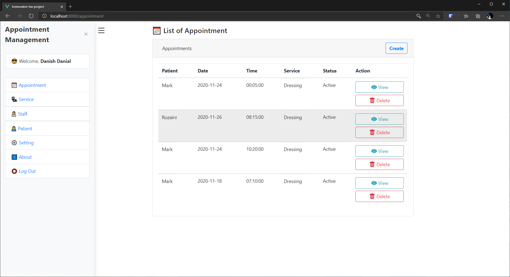

# krenovator-tsa-project



## Project setup
```
npm install
```

### Run Back-End Services
```
npm run start
```

### Run Front-End Services
```
npm run serve
```

### Compiles and minifies for production
```
npm run build
```

### Lints and fixes files
```
npm run lint
```

### Customize configuration
See [Configuration Reference](https://cli.vuejs.org/config/).
